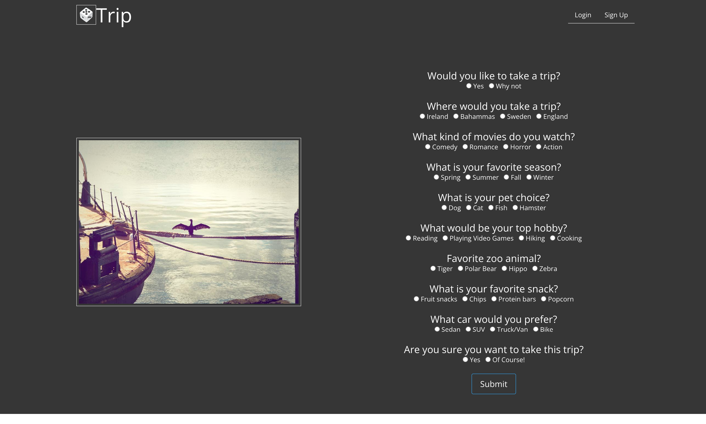

# Trip

## Table of Content
* [Description](#description)
* [Instructions](#instructions)
* [Visuals](#visuals)
* [Links](#links)
* [Technology](#technology)
* [Roadmap](#roadmap)
* [Contributing](#contributing)
* [Support](#support)
* [License](#license)

## Description
Often times we find ourselves endlessly scrolling through Instagram, devoid of any enriching or fulfilling content. Trip aims to utilize your interests to find websites, articles, and videos that you may find interesting.

## Instructions
Signup using the sign up form on the page. Once you are logged in fill out the mini questionaire. The program will take you to a random web article based on your interest from the questionaire. 

## Visuals

## Links
GitHub: https://github.com/hcruz77/Trip
Live Link: https://cannaestia.herokuapp.com/

## Technology
Bulma, Node.js, Express.js, Sequelize, Handlebars 

## Roadmap
* Clean up the landing page with better styling.
* Create a better more in depth questionaire.
* Add profile pictures and account settings.

## Contributing
* Heather Cruz
* Syd Wiegman 
* Jennifer Arnold
* Ted Shishkovskiy
* Jeffrey Pearson

## Suppport
Send support ticket to:
* Cannaestia@gmail.com
* HeatherCruz@gmail.com
* tmshishkovskiy@gmail.com
* pjeffrey40@gmail.com
* sjwiegman@gmail.com

## License 
MIT License

Copyright (c) [2022] [Trip]

Permission is hereby granted, free of charge, to any person obtaining a copy of this software and associated documentation files (the "Software"), to deal in the Software without restriction, including without limitation the rights to use, copy, modify, merge, publish, distribute, sublicense, and/or sell copies of the Software, and to permit persons to whom the Software is furnished to do so, subject to the following conditions:

The above copyright notice and this permission notice shall be included in all copies or substantial portions of the Software.

THE SOFTWARE IS PROVIDED "AS IS", WITHOUT WARRANTY OF ANY KIND, EXPRESS OR IMPLIED, INCLUDING BUT NOT LIMITED TO THE WARRANTIES OF MERCHANTABILITY, FITNESS FOR A PARTICULAR PURPOSE AND NONINFRINGEMENT. IN NO EVENT SHALL THE AUTHORS OR COPYRIGHT HOLDERS BE LIABLE FOR ANY CLAIM, DAMAGES OR OTHER LIABILITY, WHETHER IN AN ACTION OF CONTRACT, TORT OR OTHERWISE, ARISING FROM, OUT OF OR IN CONNECTION WITH THE SOFTWARE OR THE USE OR OTHER DEALINGS IN THE SOFTWARE.
